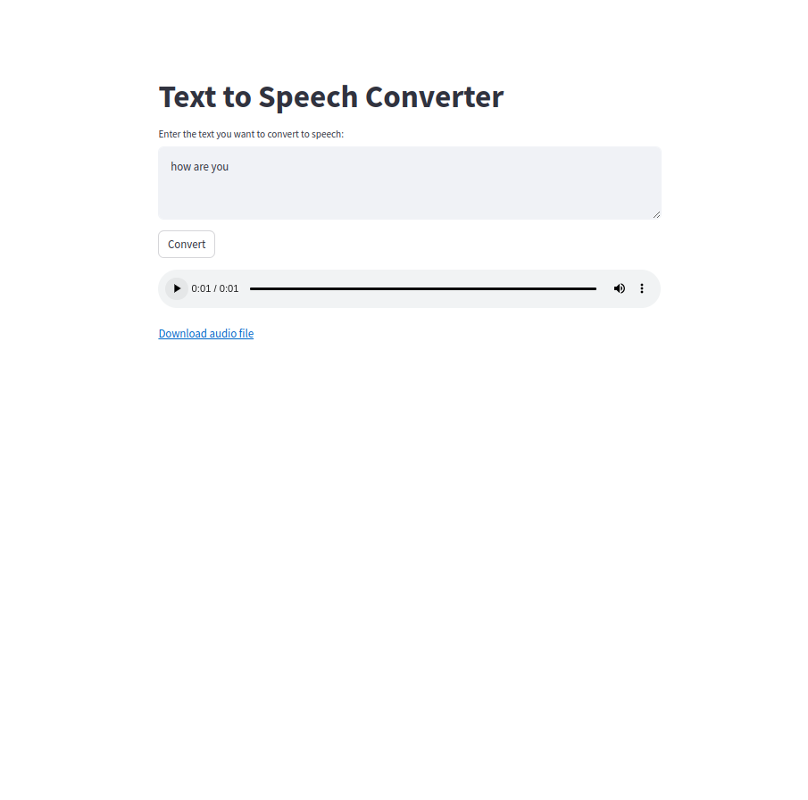

The Text to Speech Converter application is an interactive web-based tool that enables users to transform written text into spoken words. Developed with Streamlit, the program features a simple and intuitive interface where users can input the text they want to convert. Utilizing the gTTS library, the application converts the text into natural-sounding speech in MP3 format, which users can then listen to directly on the site through an embedded audio player. Moreover, it provides users with the option to download the converted audio file onto their device for future use or distribution. To ensure a smooth user experience, the application also includes input validation and displays a warning if the user tries to initiate conversion without providing any text. This tool is versatile and can be used for educational purposes, content creation, accessibility aid, and entertainment.
https://huggingface.co/spaces/razaAhmed/text_to_speech